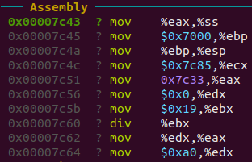
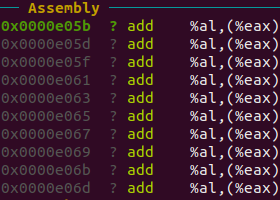

### Sistemas de Computación - FCEFyN

# Modo Protegido

## Objetivo

Crear un código assembler que pueda pasar a modo protegido sin la utilización de macros.

## Preguntas

1. ¿Cómo sería un programa que tenga dos descriptores de memoria diferentes, uno para cada segmento (código y datos) en espacios de memoria diferenciados?

2. Cambiar los bits de acceso del segmento de datos para que sea de solo lectura, intentar escribir, ¿Que sucede? ¿Que debería suceder a continuación? (revisar el teórico) Verificarlo con gdb.

3. En modo protegido, ¿Con qué valor se cargan los registros de segmento? ¿Por qué?

## Respuestas

1. Sería similar a lo que estuvimos trabajando hasta el momento solamente que estarían ubicados en distintos espacios de memoria (física).

2. Cuando se desee operar el dato de dicho segmento, esta operación va hace *trigger* de una excepción. A continuación notamos que el programa se rompe ingresando en un *LOOP* permanente. 

Pre rotura:

Post rotura:

NOTA: Agregar captura de GDB

3. El valor de los registros de segmento se cargan con el valor de la base de la data con el fin de no acceder a ese primer espacio de memoria de la GDT que por defecto y seguridad se encuentra cargado en 0x00.